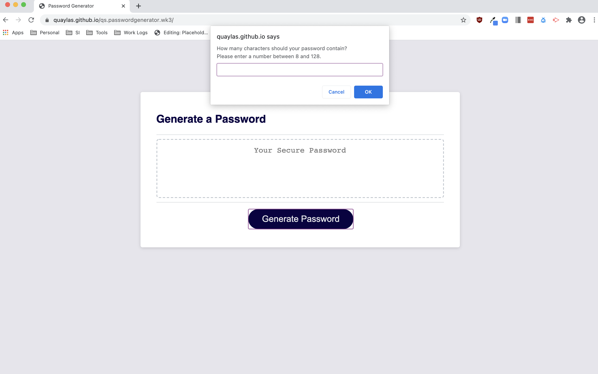
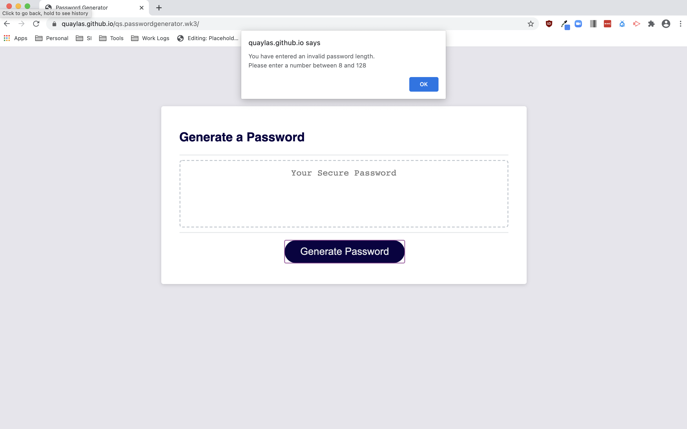

# Challenge 2: Portfolio | QS

For this week's challenge, we developed an interactive random password generator. The password generator is available [here](https://quaylas.github.io/qs.passwordgenerator.wk3/). 

Users may indicate the desired password length (8-128 characters) as well as what character types should be included.

Table of Contents
* [User Story and Acceptance Criteria](user-story-and-acceptance-criteria)
* [Key Features](key-features)
* [Images](images)

---

## User Story and Acceptance Criteria

### User Story

```
AS AN employee with access to sensitive data
I WANT to randomly generate a password that meets certain criteria
SO THAT I can create a strong password that provides greater security
```

### Acceptance Criteria

```
WHEN I click the button to generate a password
THEN I am presented with a series of prompts for password criteria
```
```
WHEN prompted for password criteria
THEN I select which criteria to include in the password
```
```
WHEN prompted for the length of the password
THEN I choose a length of at least 8 characters and no more than 128 characters
```
```
WHEN prompted for character types to include in the password
THEN I choose lowercase, uppercase, numeric, and/or special characters
```
```
WHEN I answer each prompt
THEN my input should be validated and at least one character type should be selected
```
```
WHEN all prompts are answered
THEN a password is generated that matches the selected criteria
```
```
WHEN the password is generated
THEN the password is either displayed in an alert or written to the page
```

---

## Key Features

* Users may specify their desired password length. 
* Users may indicate whether the password should contain lowercase letters
* Users may indicate whether the password should contain uppercas letters
* Users may indicate whether the password should contain numbers
* Users may indicate whether the password should contain special characters

---

## Images
### Desktop View

1440px X 1112px




### iPhone 6 View

375px X 667px

